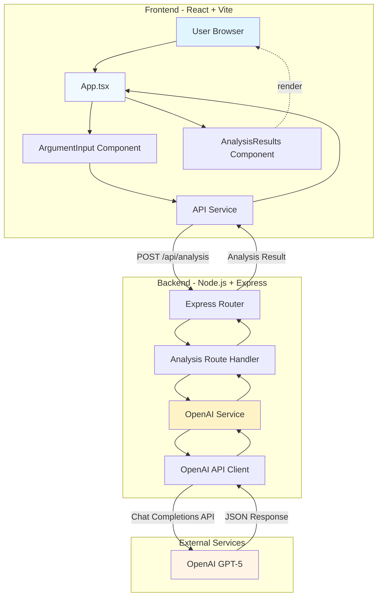

# Architecture Documentation

## System Architecture Diagram



## Component Breakdown

### Frontend Architecture

#### 1. App.tsx (Main Application)
**Purpose**: Root component that orchestrates the entire application state and flow.

**Responsibilities**:
- Manages application state (analysis result, loading state, errors)
- Coordinates communication between child components
- Handles API call lifecycle (loading, success, error states)
- Provides error handling and user feedback

**Key Design Decisions**:
- Uses React hooks (useState) for simple, functional state management
- No external state management library needed due to simple data flow
- Centralized error handling for better UX

#### 2. ArgumentInput Component
**Purpose**: Accepts user input and triggers analysis.

**Responsibilities**:
- Renders textarea for argument input
- Validates input (non-empty text)
- Manages local form state
- Provides visual feedback during loading
- Prevents duplicate submissions

**Key Features**:
- Controlled component pattern for predictable state
- Disabled state during API calls prevents race conditions
- Clear placeholder text guides user input

#### 3. AnalysisResults Component
**Purpose**: Displays the five-part analysis in a structured, readable format.

**Responsibilities**:
- Renders original argument for context
- Displays steelman counterargument
- Lists weak points, misconceptions, reinforcements, and opposing responses
- Applies color-coded styling for visual hierarchy
- Handles null state (no results yet)

**Key Features**:
- Conditional rendering (only shows when results exist)
- Semantic HTML structure (h2, ul, li)
- Color-coded sections for easy scanning

#### 4. API Service
**Purpose**: Abstracts backend communication from UI components.

**Responsibilities**:
- Constructs HTTP requests to backend
- Handles request/response transformation
- Provides error messages from failed requests
- Uses environment variables for configuration

**Benefits**:
- Separation of concerns (UI vs. network logic)
- Reusable across multiple components
- Easy to mock for testing

### Backend Architecture

#### 1. Express Server (server.ts)
**Purpose**: HTTP server that handles requests and serves the API.

**Responsibilities**:
- Initializes Express application
- Configures middleware (CORS, JSON parsing)
- Registers route handlers
- Loads environment variables
- Provides health check endpoint

**Key Configuration**:
- CORS enabled for frontend development (localhost:5173)
- JSON body parser for request payloads
- Port configuration via environment variables

#### 2. Analysis Route Handler (routes/analysis.ts)
**Purpose**: Handles the `/api/analysis` endpoint.

**Responsibilities**:
- Validates incoming requests (non-empty argument)
- Calls OpenAI service with validated input
- Catches and handles errors
- Returns JSON responses with appropriate status codes

**Error Handling**:
- 400 for invalid input (empty/missing argument)
- 500 for server errors (OpenAI failures)
- Descriptive error messages for debugging

#### 3. OpenAI Service (services/openai.ts)
**Purpose**: Encapsulates all OpenAI API interactions.

**Responsibilities**:
- Initializes OpenAI client with API key
- Constructs system and user prompts
- Makes API calls to GPT-5
- Parses JSON responses
- Transforms API responses into application types

**Prompt Structure**:
- **System Prompt**: Defines the AI's role and guidelines
- **User Prompt**: Provides the argument and output format specification
- **JSON Mode**: Ensures structured, parseable responses

**Design Benefits**:
- Single source of truth for prompt engineering
- Easy to update prompts without touching routes
- Centralized error handling for API failures

### Type System (TypeScript)

Both frontend and backend share similar TypeScript interfaces:

```typescript
interface AnalysisResult {
  originalArgument: string;
  steelmanCounter: string;
  weakPoints: string[];
  misconceptions: string[];
  reinforcements: string[];
  opposingResponses: string[];
}
```

**Benefits**:
- End-to-end type safety
- Compile-time error detection
- Better IDE support and autocomplete
- Self-documenting code

## Why This Design?

### 1. Separation of Concerns
Each component has a single, well-defined responsibility. Frontend handles presentation, backend handles business logic, and external service provides AI capabilities.

**Benefits**:
- Easier to test individual components
- Changes in one area don't cascade
- Clear ownership of functionality

### 2. React Component Architecture
Simple, flat component hierarchy with prop drilling.

**Why not Redux/Context?**
- Application state is simple (one analysis result)
- No complex state sharing across distant components
- Props are sufficient for current needs
- Avoids unnecessary complexity

### 3. Express Middleware Pattern
Standard Express architecture with routes and services.

**Benefits**:
- Familiar to Node.js developers
- Easy to extend with new routes
- Middleware composition for cross-cutting concerns

### 4. TypeScript Throughout
Both frontend and backend use TypeScript.

**Benefits**:
- Catch errors before runtime
- Shared type definitions ensure API contract adherence
- Better developer experience

### 5. Direct OpenAI Integration
No abstraction layer between our service and OpenAI.

**Why not wrap it?**
- OpenAI SDK is already well-designed
- Our use case is straightforward
- Premature abstraction adds complexity
- Easy to mock for testing if needed

## Trade-offs Made

### 1. No Database
**Decision**: Store nothing; each request is stateless.

**Trade-off**:
- ✅ Simpler architecture
- ✅ No data persistence concerns
- ✅ Easier to scale horizontally
- ❌ Can't save/compare analyses
- ❌ No usage tracking
- ❌ Can't implement caching

**Why**: For an MVP/demo, persistence adds complexity without clear benefit. Users can copy results if needed.

### 2. Synchronous API Calls
**Decision**: Frontend waits for full response before displaying results.

**Trade-off**:
- ✅ Simpler implementation
- ✅ Atomic results (all or nothing)
- ❌ Long wait time (10-30 seconds)
- ❌ No progressive disclosure
- ❌ Can't show partial results

**Why**: OpenAI's API doesn't support streaming for JSON mode. Could implement streaming for better UX in future.

### 3. Monolithic Backend
**Decision**: Single Express server handles all backend logic.

**Trade-off**:
- ✅ Simpler deployment
- ✅ No service coordination overhead
- ✅ Easier local development
- ❌ Can't scale components independently
- ❌ All logic in one process

**Why**: Current scale doesn't justify microservices complexity.
